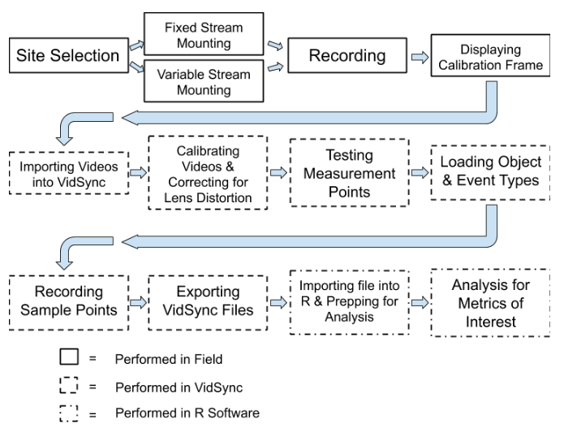
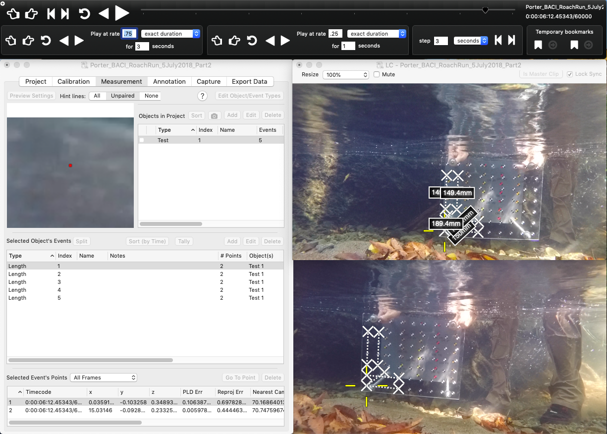

title: 'Videogrammetry Metrics for Assessing Fish Foraging Behavior: Implications
  for Behavioral Ecology and Management'
author: "Keane Flynn"
date: "4/30/2019"
output:
  word_document: default
  html_document: default
---
# **Introduction**

          Fish foraging behavior has long been a topic of natural observation,  wonder, and recreational curiosity (Walton 1655). For decades, fisheries scientists have also observed foraging behavior and considered the implications of forging behavior on fish growth and energetics (Fausch 1984; Hughes and Dill 1990; Hayes et al. 2000), adaptation to habitat variability and contexts (Dill 1983; Fausch et al. 1997; Nislow et al. 1998; Nielsen 1992), niche partitioning between sympatric species (Nakano et al. 1999a) and ontogeny (Sánchez-Hernández et al. 2012). A major challenge in the scientific study of foraging behavior has been limitations associated with visual observation, including: (1) poor estimation of quantities such as  distance, length, and time, (2) the inability to follow multiple focal animals at one time, (3) the inability to review a behavioral sequence or to share with multiple observers, (4) the inability to deal with quick or fleeting  behaviors in real time, and (5) making observations in a non-invasive method to retain natural behavior (Altmann 1974, Neuswanger 2016). Recent advances in videogrammetry and computer programming technologies have provided technological solutions/mitigation for some of these problems and made it possible to collect precise quantitative and qualitative measurements of animal behavior and interactions in 3-dimensional space (Neuswanger 2016, Hughes and Kelly 1996; Vivancos and Closs 2015, Piccolo et al. 2007, Glass 2013).
          The videogrammetric program VidSync represents one of the first open source software programs to provide quantitative 3-D functionality to fish behavior ecology (Neuswanger 2016). VidSync is a novel software program that allows the user to triangulate a 3D position, in relative space, from two or more known lines of sight (Neuswanger 2016a). The software was developed for in situ study of juvenile chinook drift-feeding behavior and growth rates (Neuswanger et al. 2014). Data collection is accomplished by calibration of two or more simultaneous in-stream videos via a dual-plane calibration frame with known, uniform distances between each point across the X, Y, Z axis (Figure 1). The primary output data from the VidSync analysis was X, Y, Z location, time, an object (subsample and fish identification number), event (foraging or interactive behavior), or measurement (e.g. length and z-axis location of the surface) (Figure 2). These coordinates, timecodes, and observations can then be exported and processed into code-based programs to create statistical and graphical representations of the data collected.
    


          Although videogrammetric programs such as VidSync have allowed for profound improvements in the functional ability to track and quantify animal behavior, locations and movement, there has yet to be an effort to synthesize classical ethology and foraging ecology methods with output from the 3-D videogrammetric tools. In addition, the possibility of using behavioral states or changes in threshold behaviors as indicators of environmental change for resource managers is enhanced by the quantitively power of 3-D videogrammetrics (Sih et al. 2011). However, this application of videogrammetry has not been explored. In this paper we will introduce a set of specific methods to quantify behavioral states and behavioral gradients in juvenile salmonids using the 3-D program VidSync focusing on behaviors with a long history of use in foraging ecology. We will also link the quantitative methods for evaluating these behaviors to potential management applications such as instream flow science or habitat restoration monitoring specifically targeting juvenile salmonids. Our objective is to provide a methodological and contextual basis for synthesize classical methods in juvenile foraging ecology with novel videogrammetric tools, and to consider the application of these methods to some targeted management scenarios.
#**Methods**
##*Overview*

          VidSync tutorials and use have been well established for creating data from video observations (Neuswanger 2014; Neuswanger 2016b). However, its use for analysis of specific metrics that might have ecological implications has not been well documented. We will look in-depth at 6 methods of data analysis, including: proportion of forage behaviors, fork length (FL) calculations, distance per time, nearest neighbor distance (NND), distance from surface, and occupied volume. For each of these analyses, we will look at the (1) use of each metric in behavioral ecology, (2) the significance of each calculation, (3) how these measurements are made for this application, and (4) exemplary R code for each of these calculations. To ensure that video observations can be converted into useful data, information flow must follow a logical path (Figure 3). Some of this information flow has been previously described and documented and is useful to use in conjunction with the methods below (Neuswanger 2016a; Neuswanger 2016b). Throughout this section, we will follow this information flow and provide methodology to turn observations into quantitative metrics.
    


##**Field Methods**
###*Streamside set up and use*

          For underwater videography, we found that using GoPro cameras allowed for a relatively low-cost method of video capture as well as wide angle lens to capture all fish in the study area continuously. Using eulerian observational methodology, creating a fixed mount system to track behavioral observations against changes in habitat has proved an effective method (Smouse et al. 2010; Vivancos and Closs 2015; Piccolo 2005; Rossi et al. 2019 in prep). To properly mount these cameras for repeated samples, we found that having multiple mount points to the streambed via rebar hammered into the alluvium ensures that the same habitat area is recorded each time. To fix the cameras to the mount, a simple device constructed from PVC pipe and bicycle mounts covers the widest amount of habitat while minimizing area where the camera angles do not overlap (Figure 4). When tracking specific individuals independent of changes in habitat, use of Lagrangian observations can be performed through variable mounting throughout the habitat tracking the target population (Neuswanger 2014). Mounting cameras for this method of observation can be performed more simply using the same materials fixed in a T-shape using a single instream rebar mount for ease of adjusting for location and angle of recording.


          When recording behavior, especially in low-flow situations, it is important to enter the river to mount the camera from downstream to avoid increasing turbidity in the study area. That being said, this method should not be employed in areas of high turbidity or poor lighting as behavior observations will be abysmal (Neuswanger 2016a). While it depends on the specific study, we recommend roughly 25-30 minutes of recording to ensure useful behavioral observations. Immediately following the recording period, someone must enter the creek with a calibration frame (from downstream to avoid increasing turbidity) and place it in front of the cameras where all points on the frame are visible (Figure 1). 
##**VidSync Methods**
###*Test Measurements*

          Once the videos have been recorded, loaded into VidSync, and calibrated, this calibrated video must be tested to ensure that the measurements are valid (Neuswanger 2014; Neuswanger 2016b). Using the known distances between points on the calibration frame, test measurements can be made along the X (front frame to rear frame), Y, and Z axes using the length function in the program to ensure that what is being measured in VidSync matches empirical measurement data (Figure 5).


###*VidSync Program Use*

          The first 5 minutes of the imported video will be discarded to allow for an adjustment period to allow fish to resume normal foraging behavior (Nakano et al. 1999; Fausch et al. 1997). The video period will be chosen via randomly stratified selection by performing a scan sample to find the most fish-dense 10 minute period of the recording, then each 30 second interval of the video is then assigned an integer (1-20) and using a random number generator, 6 random integers (1-20) representing a unique 30 second period are selected to make up a total of 3 minutes of data supported behavioral observations (Neuswanger 2014; Rossi et al. 2019 in prep). Each of these 6 chosen integers will represent a subsample within the sample video to allow for a period of total observation similar to what has been previously used with this method, however it allows for a higher sample size while removing any potential bias in sampling period. 
          Following verification of measurement accuracy, the desired subsample intervals are selected, and the video has been calibrated and corrected for lens distortion, object and event types can be created to classify subsamples and behavioral observations to be associated with sample points (Neuswanger 2016b). The object types can be used to represent unique subsamples and will be exported into a vector named, "Object(s)" which will include the title of the object as well as the "index" which is used to represent an individual fish identification number. Additionally, the option to include a name with each object is given which should be used to identify species or specific individual fish if unique identification is possible (i.e. applications with VIE tagging). These object types should be saved as follows: Subsample_1, Subsample_2, Subsample_3, Subsample_4, Subsample_5, Subsample_6.
          Following verification of measurement accuracy and the necessary object and event types are imported (see proportion of behaviors section), sample points can be recorded. Sample points are recorded in 3 second increments over the course of a 30 second subsample for a total of 11 sample points. For ease of data manipulation, each sample point for unique fish within a subsample should be taken at the same timecode (i.e. at timecode 3.000 seconds, 6.000 seconds, 9.000 seconds, etc.) until all fish in the sample are accounted for. Once all 6 subsamples have each present fish recorded, the video can then be exported from VidSync to be analyzed.
##**Data Analysis**

          For data analysis, we will be using R software to compute the aforementioned metrics (RStudio Team 2015). They can be imported into other softwares such as MATLAB and Wolfram Mathematica, however for the analyses performed below, we have found that using R is the most simple method with the most amount of outside support.
```{r setup, include = FALSE, message = FALSE}
library(dplyr)
library(readr)
library(geometry)
library(rgl)
library(stringr)
```
###*Importing VidSync CSV File*

          Data from VidSync can either be exported as an XML or CSV file, for our application we will be exporting it as the latter into R for analysis. Upon importing it, we will be cleaning up some of the data vectors using regular expression matching for ease of operation through the Stringr package in R (Whickam 2018). 
```{r warning=FALSE}
VidSync_Test_Data <- readr::read_csv(file = "VidSync-TestData.csv", 
                             skip = 2,
                             col_names = c("objects", "event", "timecode", "time_sec", "X", "Y", "Z", "pld_error", "projection_error", "nearest_camera_distance", "screen_coordinates"),
                    col_types = "cccdddddddd") %>% 
  mutate(subsample = as.numeric(str_extract(objects, "\\d"))) %>% #This column will identify which of the 6 subsamples the data belongs to.
  mutate(fish_ID = as.numeric(str_extract(objects, "\\h\\d{1,2}"))) %>% #A fish ID denotes a unique individual during each subsample. Unique individuals can be tracked across subsamples if desired, but must be given a unique name in the "Name" option (i.e. Omykiss-A1) when the Event type is specified while being processed in VidSync.
  mutate(species = str_extract(objects, "Omykiss|Okisutch")) %>% #Note that the use of regular expressions in this line are to be specified to whatever species are being recorded in your experiment and excluding any non-relevant ones.
  select(subsample, fish_ID, species, time_sec, X, Y, Z, objects, event) #All other data vectors were excluded for the sake of neatness and what is useful in the metrics below.
```
##Nearest Neighbor Distance

          Nearest neighbor distance (NND) has historically been used as a metric for understanding inter/intraspecies interactions as well as making observations about general trends regarding animal density in a study region (Clark 1954). This metric has shown to have a negative association with foraging rates and agonistic behavior in foraging juvenile salmonids (Nielsen 1992). NNDs have also been associated with relatedness in juvenile salmonids, where related fish will have closer NNDs to their kin and defend territories in groups (Brown and Brown 1993).
          NND is calculated by finding the nearest neighbor to each unique fish over the course of a subsample. This is calculated by grouping timecodes, denoted as "time_sec" in the example code, to show all fish present at the same timecode and then using the distance formula to find the distance between present fish. This is calculated using the three dimensional distance formula derived from Pythagorean's Theorem: sqrt((X1-X2)^2+(Y1-Y2)^2+(Z1-Z2)^2). The final NND column will return a single NND value for each fish in a subsample and represent the closest nearest neighbor for each fish and exclude any larger distances (in cm) so as to not skew the data away from any values that are the absolute nearest neighbor point over the course of the subsample. It is important to note that subsamples with only one observed fish will return an NND that is infinite and should be dealt with accordingly when graphing/calculating statistics of these values.
    The exemplary code is as follows:
```{r}
NND_Data <- VidSync_Test_Data %>% 
  filter(grepl("^Subsample.*", objects)) %>% #In the following two lines of code, we will be removing any extraneous data points that are not relevant to the regular 3 second interval sample points taken.
  filter(!grepl("^Length.*", event)) %>%
  na.omit() %>% #To remove any additional rows from the data set not associated with fish (i.e. surface shots).
  arrange(time_sec) %>%
  group_by(time_sec) %>%
  mutate(distance_between_X = X - lag(X, default = first(X))) %>%
  mutate(distance_between_Y = Y - lag(Y, default = first(Y))) %>%
  mutate(distance_between_Z = Z - lag(Z, default = first(Z))) %>%
  mutate(nnd_cm = sqrt((distance_between_X)^2 + 
                      (distance_between_Y)^2 +
                      (distance_between_Z)^2)) %>%
  filter(!nnd_cm == 0) %>%
  filter(nnd_cm == min(nnd_cm)) %>%
  ungroup() %>% 
  distinct(fish_ID, .keep_all = TRUE) %>% 
  arrange(subsample, fish_ID, time_sec) %>%
  select(subsample, fish_ID, nnd_cm) 
```
##Distance per Time

          Travel speeds were originally used as a variable of energy expenditure when considering optimal foraging theory (Werner and Hall 1974). Recently, this idea has expanded into bioenergetics modeling, of which swimming speeds are considered into the negative flux of energy in net rate of energy intake (NREI) calculations (Fausch 1984; Hughes 1990; Hayes et al. 2000; Rosenfeld and Taylor 2009; Li and Brocksen 1977; Brett and Glass 1973). These energy expenditures, when combined with energy intake via calculations of available prey and capture success can be converted into overall NREI values which tell us whether or not the biotic and abiotic conditions allow for potential energy profit (Fausch 1984; Hughes 1990). 
          Calculating distance per time is done by tracking a specific individual over the course of a subsample and dividing the distance travelled between each sample point by the time between each point. The distance between each point is calculated by imploring the use of the three dimensional distance formula (see NND calculation). 
    The exemplary code is as follows:
```{r}
DistancePerTime_Data <- VidSync_Test_Data %>% 
  filter(!grepl("Surface_Shots.*", objects)) %>%
  filter(!grepl("^Length.*", event)) %>%
  group_by(fish_ID) %>% 
  mutate(distance_travelled_X_cm = X - lag(X, default = first(X))) %>%
  mutate(distance_travelled_Y_cm = Y - lag(Y, default = first(Y))) %>%
  mutate(distance_travelled_Z_cm = Z - lag(Z, default = first(Z))) %>%
  mutate(fish_distance_travelled_cm = sqrt((distance_travelled_X_cm)^2
                                        + (distance_travelled_Y_cm)^2
                                        + (distance_travelled_Z_cm)^2)) %>%
  ungroup() %>% 
  group_by(fish_ID) %>%
  mutate(distance_cm_per_sec = fish_distance_travelled_cm /(time_sec - lag(time_sec, default = first(time_sec)))) %>%
  filter(!distance_cm_per_sec == Inf) %>% 
  arrange(subsample, fish_ID, time_sec) %>%
  select(subsample, fish_ID, time_sec, distance_cm_per_sec)
```
##Proportion of Behaviors
    
          Foraging behaviors have been an indicator of bioenergetically favorable or unfavorable conditions in natural stream conditions (Fausch 1984; Hughes 1990). By breaking down foraging behaviors based on this 4 group classification, it provides indication of the location of primary prey input and potential bioenergetic outcomes to conditions based on prey input, habitat quality, and flow assessment. Using these habitat and behavioral assessments, we can make general assessments to bioenergetic conditions based on foraging behaviors.
          To convert behavioral assessments to useful data linked to location-based sample points with associated timecodes, the behavior types will be recorded in the VidSync program as event types. The event types input will be represented by the behavioral classifications assigned to each 3 second sample increment in each subsample. This length of time allows for classification of unique behaviors as well as tracking movement accurately with small temporal increments (Rossi et al. 2019 in prep). The behavior classifications, as well as additional points to be recorded, and their definitions have been used or adopted from prior behavioral studies with some modifications (Kalleberg 1958; Nielsen 1992; Nakano et al. 1999a). They are as follows:
    
    Benthic Forage: A distinct forage event targeted at the stream benthos.
    Drift Forage: A fish maintaining positive rheotaxis to target prey carried through the water column in a sit-and-wait fashion. 
    Search Forage: A fish covering large foraging patches in search of non-benthic prey.
    Surface Strike: A fish making contact with the water surface to obtain prey.
    Aspirating: A fish visibly flaring their gills while minimally moving and making no forage attempts. 
    Attack: A fish making contact with another fish in an act of territoriality.
    Feint: Adopted from a fencing term, a fish will charge another in an act of territoriality, but make no contact and quickly resume foraging thereafter.
    Movement: Any movement throughout the pool not focused on foraging.
    Length: A fork length measurement taken by creating a point at the nose and the fork of the caudal fin and using the three-dimensional distance formula to calculate length.

    To assign a behavior type we use regular expressions to identify the behavior from the predetermined object type as specified above in the behavioral classification section. After each sample point has been identified and placed in a bin of behavior types using a nested "if-else" chain, specific behaviors can then be filtered out depending upon the target variables (i.e. only foraging behavior types).
    The exemplary code is as follows:
```{r}
ForageBehaviors_Data <- VidSync_Test_Data %>% 
  filter(!grepl("Surface_Shots.*", objects)) %>%
  filter(!grepl("^Length.*", event)) %>%
  mutate(Behaviors = if_else(grepl("^Drift_Forage", event), "Drift Forage", 
                     if_else(grepl("^Search_Forage", event), "Search Forage", 
                     if_else(grepl("^Search_Forage", event), "Search Forage", 
                     if_else(grepl("^Benthic_Forage", event), "Benthic Forage", 
                     if_else(grepl("^Feint", event), "Feint", 
                     if_else(grepl("^Attack", event), "Attack",
                     if_else(grepl("^Surface_Strike", event), "Surface Strike", 
                     if_else(grepl("^Movement", event), "Movement", "NA"))))))))) %>% 
  arrange(subsample, fish_ID, time_sec) %>% 
  select(subsample, fish_ID, time_sec, Behaviors)
```
##Distance from Surface
          
          Analysis of stratification of fish foraging position has shown to be indicative of vary ecological conditions such as water quality stratification and location of prey input (Nakano 1999b; Nielsen 1994). Taking into consideration the fish foraging locations along the z-axis in combination with water quality conditions and prey availability, these locations can be indicative of relevant stream conditions that might influence juvenile salmonid health, prey availability, and growth potential (Nakano 1999b; Carter 2005).
          The distance from surface data is created based upon the z-axis location of the median z-axis location of each recorded fish ID during a subsample. This data can then be combined with stage height, max depth, etc. data to create standardized metrics for average location of fish during a sample period.
          The exemplary code is as follows:
```{r, warning=FALSE}
DFS_Median <- VidSync_Test_Data %>% 
  filter(grepl("Surface_Shots.*", objects)) %>% 
  summarise(median(Z)) %>% 
  as.matrix()
DistFromSurface_Data <- VidSync_Test_Data %>%
  filter(!grepl("^Length.*", event), 
         !grepl("Surface_Shots.*", objects)) %>%
  select(subsample, fish_ID, time_sec, Z, event) %>% 
  group_by(fish_ID) %>%
  mutate(median = median(Z)) %>%
  mutate(DFS_cm = abs(median - DFS_Median)) %>% 
  distinct(fish_ID, .keep_all = TRUE) %>% 
  select(subsample, fish_ID, DFS_cm)
```
##Fork Length Calculations

          Fork length has been used as a standard measurement in fish taxa with homocercal caudal fins and to create length-weight regressions (Hoar 1939). Fork length measurements have found their place in behavioral ecology studies being  used with foraging territory locations to classify community hierarchies (Abbott and Dunbrack 1985; Nakano and Furukawa‐Tanaka 1994). Additionally, this method of fish length observation has the potential to be used in combination with visible external tagging methods (i.e. VIE tagging, thermal tagging, etc.) to monitor growth of unique individuals assuming they remain in the study area. This method would allow for substitution of electrofishing to monitor fish growth.
          During each subsample, three length values should be taken for each fish to ensure that there are no outlier measurements. Fork length measurements are taken by using the length event type and adding a sample point at the snout and the fork of each fish. These points will be exported from VidSync with the same event type name and can then be grouped to apply the distance formula (see NND calculation) between these points to find fork length. The average of the three fork lengths taken for each fish are then taken to find the final fork length for each unique individual.
          The exemplary code is as follows:
```{R}
Length_Data <- VidSync_Test_Data %>% 
  filter(grepl("^Length.*", event)) %>% 
  na.omit() %>% 
  group_by(event) %>% 
  mutate(length_mm = 10*sqrt((X - lag(X, default = first(X)))^2 + #Multiplied by 10 since default measurements are in cm
                             (Y - lag(Y, default = first(Y)))^2 + 
                             (Z - lag(Z, default = first(Z)))^2)) %>% 
  filter(!length_mm == 0) %>% 
  group_by(subsample, fish_ID) %>% 
  summarise(length_mm = mean(length_mm)) %>% 
  arrange(subsample, fish_ID)
```
##Occupied Volumes

          Fish territories have traditionally been measured as an area since quantifying z-axis position has been a difficult observation to make with snorkel survey in focal point sampling (Vivancos and Closs 2015; Steingrimmson and Grant 2008; Steingrimmson and Grant 2011). Hutchinson described an individual's niche as an N-dimensional hypervolume, with recent advances in behavioral observation technology we are now able to define this niche as a three dimensional volume as opposed to a two dimensional area (Hutchinson 1965). This can be done using convex hull modeling of a three dimensional point cloud of sample points from a subsample (Cornwell et al. 2006; Blonder et al. 2014). While there is limited use of this analytical method, we are able to increase the dimensionality of the hypervolume from what previous methodology allowed (Glass 2013). When combined with eulerian observations, changes in hypervolumes can be tracked in conjunction with any other variables collected in the study period such as streamflow, prey availability, water quality, etc. (Rossi unpublished).
          This method makes use of Delaunay triangulation to calculate the volumes of a three-dimensional point cloud using the convhulln function from the "Geometry" package in R (Habel et al. 2015). Each occupied volume is calculated by grouping data into that of individual fish in individual subsamples. Once unique volume data is obtained for each fish, it can then be coerced into total occupied volume data, average volumes, etc. Alternatively, these calculations can be made through the "Hypervolume" package in R (Blonder and Harris 2018). This method does provide additional services such as calculating overlapping volume between individuals sharing foraging territory.
    The exemplary code is as follows:
```{r}
Volume_Data <- VidSync_Test_Data %>% 
  filter(!grepl("Surface_Shots.*", objects)) %>%
  filter(!grepl("^Length.*", event)) %>%
  select(subsample, fish_ID, X, Y, Z) %>%
  arrange(subsample, fish_ID)
Test_Volume <- Volume_Data %>% 
  filter(fish_ID == 1) %>% #Using a point cloud output from a subsample as example
  select(X, Y, Z) %>%
  as.matrix() %>%
  geometry::convhulln("FA") 
  print(Test_Volume$vol) #Displayed in cubic centimeters
  
#This can also be run in a for loop over the entire dataset from the sample to occupy a data frame with the collected volume data
Vol_forloop <- 
for (i in 1:33) {
  Volume_Data %>%
  filter(fish_ID == i) %>%
  select(X, Y, Z) %>%
  as.matrix() %>%
  geometry::convhulln("FA") 
}
```
#Discussion

          While the benefits of using VidSync paired with structured programming analysis include more precise and accurate data collection, tracking changes in qualitative and quantitative behavior metrics has proven to be an effective proxy for habitat changes when paired with dynamic environmental data (Neuswanger 2014; Rossi et al. 2019 in prep; Glass 2013). Many conservation efforts focus on improving hydrology conditions in hopes of improving habitat for impacted fish species. These efforts generally focus on improving the quantity of fish and their weighted usable habitat area but generally don't monitor the fish habitat quality (Bovee 1978). Incorporating VidSync use into river management projects would allow for a better assessment of the success of habitat enhancements by not only monitoring fish quantity, but also by the degree to which they are using their habitat (i.e. drift foraging vs. aspirating).
          Implementing use of VidSync has many benefits in acute analysis of fish behavior as outlined in the methods section. It is, however, important to note that there are a number of drawbacks to using this program in research and monitoring applications. While the software is free, the cost of purchasing necessary recording and calibration equipment is expensive and requires more time to properly install at the study sites than simply snorkeling and recording observations. After recording, there are a few issues that can be encountered since conditions are generally never as perfect as can be desired. The first issue in post-processing is the time it takes to process a video and gather data, especially in fish-dense videos which can take up to 8 hours. Next, cameras have a limited range of clear visibility and combined with potentially turbid conditions makes taking sample points, species identification, and correct behavioral assessment more difficult than under optimal conditions. Lastly, snorkeling methods do allow for a wider and more variable range of visibility while using fixed camera positions during a video sample could potentially exclude individuals that might be selectively foraging outside of the field of view which is a potential area for introducing bias.
          Previous methods of fish behavioral observation have paved the way for creating these improved and refined metrics and have shown the relevance of fish observations in behavioral ecology. With this available improvement in monitoring and analysis we can apply these metrics with more confidence in the measurements taken and how they relate to changes in habitat.
#Acknowledgements

          I would like to thank the UC Berkeley cohort of Mary Power, Stephanie Carlson, Ted Grantham, and Albert Ruhi's labs that have provided tremendous support on this project. My sincerest gratitude is owed to Gabriel Rossi who first introduced me into the rabbit hole that is my love for studying fish and freshwater ecology in general and got me started exploring the possibilities of this program. Additionally, I would like to thank the Eel River Critical Zone Observatory and California SeaGrant for allowing us to work with them on many of their study sites and to use and include these methods as part of larger research projects. I would lastly like to thank many bluegrass and southern rock musicians who provided much needed karaoke material on travels to and from the field. "You better stay away from Copperhead Road" - Steve Earl
#Citations
Abbott, J. C., Dunbrack, R. L., & Orr, C. D. 1985. The interaction of size and experience in dominance relationships of juvenile steelhead trout (Salmo gairdneri). Behaviour: 241-253.

Altmann, J. 1974. Observational study of behavior: sampling methods. Behaviour, 49(3-4): 227-266.

Blonder, B., Lamanna, C., Violle, C., & Enquist, B. J. 2014. The n‐dimensional hypervolume. Global Ecology and Biogeography, 23(5): 595-609.

Blonder, B., & Harris, David J. 2018. Hypervolume: High Dimensional Geometry and Set Operations Using Kernel Density Estimation, Support Vector Machines, and Convex Hulls. R package
version 2.0.11. https://CRAN.R-project.org/package=hypervolume

Bovee, K. D. 1978. Probability-of-use criteria for the family Salmonidae (No. 4). Department of the Interior, Fish and Wildlife Service, Office of Biological Services, Western Energy and Land Use Team, Cooperative Instream Flow Service Group.

Brett, J. R., & Glass, N. R. 1973. Metabolic rates and critical swimming speeds of sockeye salmon (Oncorhynchus nerka) in relation to size and temperature. Journal of the Fisheries Board of Canada, 30(3): 379-387.

Brown, G. E., & Brown, J. A. 1993. Do kin always make better neighbours?: the effects of territory quality. Behavioral Ecology and Sociobiology, 33(4), 225-231.

Carter, K. 2005. The effects of dissolved oxygen on steelhead trout, coho salmon, and chinook salmon biology and function by life stage. California Regional Water Quality Control Board, North Coast Region.

Clark, P. J., & Evans, F. C. 1954. Distance to nearest neighbor as a measure of spatial relationships in populations. Ecology, 35(4): 445-453.

Cornwell, W. K., Schwilk, D. W., & Ackerly, D. D. 2006. A trait‐based test for habitat filtering: convex hull volume. Ecology, 87(6): 1465-1471.

Dill, L. M. 1983. Adaptive flexibility in the foraging behavior of fishes. Canadian Journal of Fisheries and Aquatic Sciences, 40(4): 398-408.

Fausch, K. D. 1984. Profitable stream positions for salmonids: relating specific growth rate to net energy gain. Canadian journal of zoology, 62(3): 441-451.

Fausch, K. D., Nakano, S., & Kitano, S. 1997. Experimentally induced foraging mode shift by sympatric charrs in a Japanese mountain stream. Behavioral Ecology, 8(4): 414-420.

Flore, L., Reckendorfer, W., & Keckeis, H. 2000. Reaction field, capture field, and search volume of 0+ nase (Chondrostoma nasus): effects of body size and water velocity. Canadian Journal of Fisheries and Aquatic Sciences, 57(2): 342-350.

Glass, T. 2013. Effects of water velocity and fish length on the shape and size of the foraging areas of juvenile salmonids.

Grant, J. W., Weir, L. K., & Steingrímsson, S. Ó. 2017. Territory size decreases minimally with increasing food abundance in stream salmonids: Implications for population regulation. Journal of Animal Ecology, 86(6): 1308-1316.

Habel, K., Grasman, R., Gramacy, Robert B., Stahel, A., & Sterratt, David C. 2015. geometry: Mesh
Generation and Surface Tesselation. R package version 0.3-6. https://CRAN.R-project.org/package=geometry

Hayes, J. W., Stark, J. D., & Shearer, K. A. 2000. Development and test of a whole-lifetime foraging and bioenergetics growth model for drift-feeding brown trout. Transactions of the American Fisheries Society, 129(2): 315-332.

Hoar, W. S. 1939. The weight-length relationship of the Atlantic salmon. Journal of the Fisheries Board of Canada, 4(5): 441-460.

Hooge, P. N., & Eichenlaub, B. 2000. Animal movement extension to ArcView 2.0. USGS Alaska Science Center, Anchorage, AK.

Hughes, N. F., & Dill, L. M. 1990. Position choice by drift-feeding salmonids: model and test for Arctic grayling (Thymallus arcticus) in subarctic mountain streams, interior Alaska. Canadian Journal of Fisheries and Aquatic Sciences, 47(10): 2039-2048.

Hughes, N. F., & Kelly, L. H. 1996. New techniques for 3-D video tracking of fish swimming movements in still or flowing water. Canadian Journal of Fisheries and Aquatic Sciences, 53(11): 2473-2483.

Hutchinson, G. E. 1965. The ecological theater and the evolutionary play. Yale University Press.

Kalleberg, H. 1958. Observations in a stream tank of territoriality and competition in juvenile salmon and trout. Rep. Inst. Freshw. Res. Drottninigholm, 39: 55-98.

Li, H. W., & Brocksen, R. W. 1977. Approaches to the analysis of energetic costs of intraspecific competition for space by rainbow trout (Salmo gairdneri). Journal of Fish Biology, 11(4): 329-341.

Nakano, S., & Furukawa‐Tanaka, T. 1994. Intra‐and interspecific dominance hierarchies and variation in foraging tactics of two species of stream‐dwelling chars. Ecological Research, 9(1): 9-20.

Nakano, S., Fausch, K. D., & Kitano, S. 1999a. Flexible niche partitioning via a foraging mode shift: a proposed mechanism for coexistence in stream‐dwelling charrs. Journal of Animal Ecology, 68(6): 1079-1092.

Nakano, S., Kawaguchi, Y., Taniguchi, Y., Miyasaka, H., Shibata, Y., Urabe, H., & Kuhara, N. 1999b. Selective foraging on terrestrial invertebrates by rainbow trout in a forested headwater stream in northern Japan. Ecological Research, 14(4): 351-360.

Neuswanger, J., Wipfli, M. S., Rosenberger, A. E., & Hughes, N. F. 2014. Mechanisms of drift-feeding behavior in juvenile Chinook salmon and the role of inedible debris in a clear-water Alaskan stream. Environmental biology of fishes, 97(5): 489-503.

Neuswanger, Jason R., Wipfli, Mark S., Rosenberger, Amanda E., and Hughes, 
Nicholas F. 2016a. Measuring fish and their physical habitats: Versatile 2-D and 3-D video techniques with user-friendly software. Canadian Journal of Fisheries and Aquatic Sciences 73(12): 1861-1873.

Neuswanger, Jason R. Drift Model Project. 2016b. VidSync 3-D Video Analysis Tutorial. Retrieved from https://www.youtube.com/watch?v=tJKVgfPcC-A&t=5273s

Nielsen, J. L. 1992. Microhabitat-specific foraging behavior, diet, and growth of juvenile coho salmon. Transactions of the American Fisheries Society, 121(5): 617-634.

Nielsen, J. L., Lisle, T. E., & Ozaki, V. 1994. Thermally stratified pools and their use by steelhead in northern California streams. Transactions of the American Fisheries Society, 123(4): 613-626.

Nislow, K. H., Folt, C., & Seandel, M. 1998. Food and foraging behavior in relation to microhabitat use and survival of age-0 Atlantic salmon. Canadian Journal of Fisheries and Aquatic Sciences, 55(1): 116-127.

Piccolo, J. J. 2005. The Influence of Water Velocity and Depth on Prey Detection and Capture by Juvenile Coho Salmon and Steelhead: Implications for Habitat Selection and Segregation (Doctoral dissertation).

Piccolo, J. J., Hughes, N. F., & Bryant, M. D. 2007. The effects of water depth on prey detection and capture by juvenile coho salmon and steelhead. Ecology of freshwater fish, 16(3): 432-441.

Rosenfeld, J. S., & Taylor, J. 2009. Prey abundance, channel structure and the allometry of growth rate potential for juvenile trout. Fisheries Management and Ecology, 16(3): 202-218.

Rossi, Gabriel J., Power, Mary E., Pneh, Shelly, Neuswanger, Jason R. 2019 in preparation. Seasonal Foraging Mode Shifts of Oncorhynchus mykiss in a Mediterranean Stream.

RStudio Team. 2015. RStudio: Integrated Development for R. RStudio, Inc., Boston, MA URL http://www.rstudio.com/.

Sánchez-Hernández, J., Servia, M. J., Vieira-Lanero, R., & Cobo, F. 2012. Ontogenetic dietary shifts in a predatory freshwater fish species: the brown trout as an example of a dynamic fish species. In New advances and contributions to fish biology. IntechOpen.

Sih, A., Ferrari, M. C., & Harris, D. J.2011. Evolution and behavioural responses to human‐induced rapid environmental change. Evolutionary applications, 4(2): 367-387.

Smouse, P. E., Focardi, S., Moorcroft, P. R., Kie, J. G., Forester, J. D., & Morales, J. M. 2010. Stochastic modelling of animal movement. Philosophical Transactions of the Royal Society B: Biological Sciences, 365(1550): 2201-2211.

Steingrímsson, S. Ó., & Grant, J. W. 2008. Multiple central‐place territories in wild young‐of‐the‐year Atlantic salmon Salmo salar. Journal of Animal Ecology, 77(3): 448-457.

Steingrimsson, S.Ó., and Grant, J.W.A. 2011. Shape of single and multiple central-place territories in a stream-dwelling fish. Ethology 117: 1170-1177.

Tunney, T. D., & Steingrímsson, S. Ó. 2012. Foraging mode variation in three stream‐dwelling salmonid fishes. Ecology of Freshwater Fish, 21(4): 570-580.

Vivancos, A., & Closs, G. P. 2015. Quantification and comparison of individual space-use strategies in foraging drift-feeding fish using fine-scale, multidimensional movement analysis. Canadian journal of fisheries and aquatic sciences, 72(11): 1760-1768.

Walton, Izaak. 1655. The Compleat Angler, or, The Contemplative Man's Recreation : Being a Discourse of Rivers, and Fish-Ponds, and Fish, and Fishing, Not Unworthy the Perusal of Most Anglers. London: Printed by T. M. [ie. T. Maxey] for Rich. Marriot, and are to be sold at his shop. Print.

Wickham, Hadley. 2018. stringr: Simple, Consistent Wrappers for
Common String Operations. R package version 1.3.1.
https://CRAN.R-project.org/package=stringr
