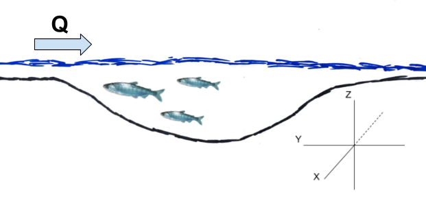

Videogrammetry Metrics for Assessing Fish Foraging Behavior: Implications for Behavioral Ecology and Management
================
Keane Flynn
4/30/2019

**Introduction**
================

    Fish foraging behavior has long been a topic of natural observation, wonder, and recreational curiosity (Walton 1655). In recent years, this area of observation has extended beyond the realm as an enigmatic phenomenon and taken its place as a series of qualitative metrics in fisheries ecology. But with recent advances in computer technologies and programming languages, we are capable of extending these qualitatives behavioral metrics into quantitative values which can be further mathematically and statistically analyzed to show distinct differences in behavior. These differences in foraging behaviors have been shown to be linked to changes in physical habitat characteristics that might be indicative of decreasing habitat quality for foraging fish (Rossi et al. 2019 in prep; Steingrímmson 2012; Fausch et al. 1997).
    Using the three dimensional videogrammetric program VidSync, quantifying previously generalized qualitative/quantitative values has become a relatively easy process that has the potential to offer results with more statistical significance than previous behavioral observation methods (Neuswanger 2014). This method makes use of two underwater cameras mounted in a fixed location relative to one another recording simultaneous video of fish behavior. Doing so allows for an almost entirely non-invasive way to record fish behavior, whereas many current methods rely on snorkel observations. Once the videos have been processed, an   X, Y, Z coordinate, a timecode, and a behavioral observation type are assigned to each point created for the video sample in the program. These coordinates, timecodes, and observations can then be exported and processed into code-based programs to create statistical and graphical representations of the data collected.
    This program offers a number of advantages to traditional fish foraging observations, the largest of which being ease of quantifying spatial habitat use metrics within sub-millimeter accuracy, which will be expanded upon in the methods section. Additionally, this method of observation allows to expand forage observations beyond focal animal sampling, which has been the most common method for recording fish behavior in natural experiments, to other methods of behavior sampling methods such as sampling all occurrences of behaviors, sequence sampling, and scan sampling (Altmann 1974). While previous field observation methods could only account for one of these observation methods based on physical restrictions, replayable video allows for a higher confidence in behavioral observation assignment. Being able to track multiple individuals throughout a video sample allows for a complete assessment of behavioural observations for all individuals in the sample, hence creating a larger sample size for improved statistical analysis.
    In previous research, these estimations of distances travelled, area of habitat, size of subjects, specific foraging patches, etc. conducted during snorkel surveys were capable of assigning numeric values to these metrics, but with a higher degree of uncertainty (Nakano et al. 1999; Nielsen 1992; Steingrímsson & Grant 2008). While some of these methods have proved useful for changes in habitat usage, these methods are inherently based on location estimations and lack critical pieces of information for properly classifying habitat use. The issue with these previously used methods is that the metrics for habitat use is generally two-dimensional, which disregards many phenomenon such as physical habitat characteristics and location of prey input that might affect location of fish along the Z-axis (Figure 1).



    We hope to address some of the potential uses of these methods, but also realize that there are situations in which it might not be in the best interest to use these methods: they involve more post-capture editing and analyzation than that of snorkel observations, plotting movement movement points and territories can be more complex than doing so using the animal movement extension in ArcView (Hooge & Eichenlaub 2000). Given the resources to use this method are available, we find that it has many attributes that make up for the shortcomings of previously used methods. In this paper, we will elaborate upon the metrics that can be accurately derived using VidSync and the ecological implications of each. 

Methods
=======

### *Streamside set up and use*

    For underwater videography, we found that using GoPro cameras allowed for a relatively low-cost method of video capture as well as wide angle lens to capture all fish in the study area continuously. To properly mount these cameras for multiple samples at the same site, we found that having multiple mount points to the streambed via rebar hammered into the alluvium ensures that the same habitat area is recorded each time. To fix the cameras to the mount, a simple device made from PVC pipe and bicycle mounts covers the widest amount of habitat while minimizing area where the camera angles do not overlap (Figure 2). 


    When recording behavior, especially in low-flow situations, it is important to enter the river to mount the camera from downstream to avoid increasing turbidity in the study area. That being said, this method should not be employed in areas of high turbidity as behavior observations will be abysmal. While it depends on the specific study, we recommend roughly 25-30 minutes of recording to ensure usable behavioral observations are recorded. Immediately following the recording period, someone must enter the creek with a calibration frame (from downstream to avoid increasing turbidity) and place it in front of the cameras where all points on the frame are visible (Figure 3). 


### *Test Measurements*

Once the videos have been recorded, loaded into VidSync, and calibrated, this calibrated video must be tested to ensure that the measurements are valid (Neuswanger 2014; Neuswanger 2016). Using the known distances between points on the calibration frame, test measurements can be made along the X (front frame to rear frame), Y, and Z axes using the length function in the program to ensure that what you are measuring in VidSync matches empirical measurement data (Figure 1).

### *Video Period Selection*

The first 5 minutes of the video will be discarded to allow for an adjustment period to allow fish to resume normal foraging behavior (Nakano et al. 1999; Fausch et al. 1997). The video period being chosen will be randomly selected but first we must, by a quick scan sample, find the most fish-dense 10 minute period of the recording. In order, each 30 second interval of the video is then assigned an integer (1-20) and using a random number generator, 6 random integers (1-20) representing a unique 30 second period are selected to make up a total of 3 minutes of data supported behavioral observations (Neuswanger 2014; Rossi et al. 2019 in prep). Each of these 6 chosen integers will represent a subsample within the sample video to allow for a period of total observation similar to what has been previously used with this method, however it allows for a higher sample size while removing any potential bias in sampling period.

### *VidSync Use and Behavior Classification*

Once the desired subsample intervals are selected, the video has been calibrated and corrected for lens distortion, object and event types can then be created to classify subsamples and behavioral observations to be associated with recorded coordinate points (Neuswanger 2016). The object types

R-code and Examplary Data for Quantitative and Qualitative Behavioral Metrics
=============================================================================

Load Libraries
--------------

``` r
library(dplyr)
```

    ## 
    ## Attaching package: 'dplyr'

    ## The following objects are masked from 'package:stats':
    ## 
    ##     filter, lag

    ## The following objects are masked from 'package:base':
    ## 
    ##     intersect, setdiff, setequal, union

``` r
library(readr)
library(tidyverse)
```

    ## ── Attaching packages ──────────────────────────────────────────────────────────────────────────────── tidyverse 1.2.1 ──

    ## ✔ ggplot2 3.0.0     ✔ purrr   0.2.5
    ## ✔ tibble  1.4.2     ✔ stringr 1.3.1
    ## ✔ tidyr   0.8.1     ✔ forcats 0.3.0

    ## ── Conflicts ─────────────────────────────────────────────────────────────────────────────────── tidyverse_conflicts() ──
    ## ✖ dplyr::filter() masks stats::filter()
    ## ✖ dplyr::lag()    masks stats::lag()

``` r
library(ggplot2)
library(lubridate)
```

    ## 
    ## Attaching package: 'lubridate'

    ## The following object is masked from 'package:base':
    ## 
    ##     date

``` r
library(geometry)
```

    ## Loading required package: magic

    ## Loading required package: abind

``` r
library(rgl)
library(hypervolume)
```

    ## Loading required package: Rcpp

``` r
library(zoo)
```

    ## 
    ## Attaching package: 'zoo'

    ## The following objects are masked from 'package:base':
    ## 
    ##     as.Date, as.Date.numeric

``` r
library(stringr)
library(data.table)
```

    ## 
    ## Attaching package: 'data.table'

    ## The following object is masked from 'package:magic':
    ## 
    ##     shift

    ## The following objects are masked from 'package:lubridate':
    ## 
    ##     hour, isoweek, mday, minute, month, quarter, second, wday,
    ##     week, yday, year

    ## The following object is masked from 'package:purrr':
    ## 
    ##     transpose

    ## The following objects are masked from 'package:dplyr':
    ## 
    ##     between, first, last

Importing VidSync CSV File
==========================

``` r
VidSync_Test_Data <- readr::read_csv(file = "Porter_BACI_RoachRun_5July2018_Part1.csv", 
                             skip = 2,
                             col_names = c("objects", "event", "timecode", "time_sec", "X", "Y", "Z", "pld_error", "projection_error", "nearest_camera_distance", "screen_coordinates"),
                    col_types = "cccdddddddd") %>% 
  mutate(subsample = as.numeric(str_extract(objects, "\\d"))) %>%
  mutate(fish_ID = as.numeric(str_extract(objects, "\\h\\d{1,2}"))) %>%
  mutate(species = str_extract(objects, "Omykiss|Okisutch")) %>% #Note that the use of regular expressions in this line are to be specified to whatever species are recorded in your experiment
  select(subsample, fish_ID, species, time_sec, X, Y, Z, objects, event) #All other data vectors were excluded for the sake of neatness and what is useful in the metrics below
```

    ## Warning in rbind(names(probs), probs_f): number of columns of result is not
    ## a multiple of vector length (arg 1)

    ## Warning: 475 parsing failures.
    ## row # A tibble: 5 x 5 col     row col   expected   actual     file                                   expected   <int> <chr> <chr>      <chr>      <chr>                                  actual 1     1 <NA>  11 columns 10 columns 'Porter_BACI_RoachRun_5July2018_Part1… file 2     2 <NA>  11 columns 10 columns 'Porter_BACI_RoachRun_5July2018_Part1… row 3     3 <NA>  11 columns 10 columns 'Porter_BACI_RoachRun_5July2018_Part1… col 4     4 <NA>  11 columns 10 columns 'Porter_BACI_RoachRun_5July2018_Part1… expected 5     5 <NA>  11 columns 10 columns 'Porter_BACI_RoachRun_5July2018_Part1…
    ## ... ................. ... .......................................................................... ........ .......................................................................... ...... .......................................................................... .... .......................................................................... ... .......................................................................... ... .......................................................................... ........ ..........................................................................
    ## See problems(...) for more details.

Nearest Neighbor Distance (NND)
===============================

NND is calculated by finding the nearest neighbor to each unique fish over the course of a subsample. The final NND column will represent the closest nearest neighbor for each fish and exclude any larger distances (in cm) so as to not skew the data away from any values that are the absolute nearest neighbor point over the course of the subsample. It is important to note that subsamples with only one observed fish will produce an NND that is infinite and should be dealt with accordingly when graphing/calculating statistics on these values.

``` r
NND_Data <- VidSync_Test_Data %>% 
  filter(grepl("^Subsample.*", objects)) %>%
  filter(!grepl("^Length.*", event)) %>%
  filter(!grepl("^Attack.*", event)) %>%
  filter(!grepl("^Nip.*", event)) %>%
  na.omit() %>% #To remove any additional rows from the data set not associated with fish (i.e. surface shots)
  arrange(time_sec) %>%
  group_by(time_sec) %>%
  mutate(distance_between_X = X - lag(X, default = first(X))) %>%
  mutate(distance_between_Y = Y - lag(Y, default = first(Y))) %>%
  mutate(distance_between_Z = Z - lag(Z, default = first(Z))) %>%
  mutate(nnd_cm = sqrt((distance_between_X)^2 + 
                      (distance_between_Y)^2 +
                      (distance_between_Z)^2)) %>%
  group_by(time_sec) %>%
  filter(!nnd_cm == 0) %>%
  filter(nnd_cm == min(nnd_cm)) %>%
  ungroup() %>% 
  distinct(fish_ID, .keep_all = TRUE) %>% 
  arrange(subsample, fish_ID, time_sec) %>%
  select(subsample, fish_ID, time_sec, nnd_cm) 
```

Distance per Time
=================

``` r
DistancePerTime_Data <- VidSync_Test_Data %>% 
  filter(!grepl("Surface_Shots.*", objects)) %>%
  filter(!grepl("^Length.*", event)) %>%
  group_by(fish_ID) %>% 
  mutate(distance_travelled_X_cm = X - lag(X, default = first(X))) %>%
  mutate(distance_travelled_Y_cm = Y - lag(Y, default = first(Y))) %>%
  mutate(distance_travelled_Z_cm = Z - lag(Z, default = first(Z))) %>%
  mutate(fish_distance_travelled_cm = sqrt((distance_travelled_X_cm)^2
                                        + (distance_travelled_Y_cm)^2
                                        + (distance_travelled_Z_cm)^2)) %>%
  ungroup() %>% 
  group_by(fish_ID) %>%
  mutate(distance_cm_per_sec = fish_distance_travelled_cm /(time_sec - lag(time_sec, default = first(time_sec)))) %>%
  filter(!distance_cm_per_sec == Inf) %>% 
  arrange(subsample, fish_ID, time_sec) %>%
  select(subsample, fish_ID, time_sec, distance_cm_per_sec)
```

Proportion of Forage Behaviors
==============================

``` r
ForageBehaviors_Data <- VidSync_Test_Data %>% 
  filter(!grepl("Surface_Shots.*", objects)) %>%
  filter(!grepl("^Length.*", event)) %>%
  mutate(Behaviors = if_else(grepl("^Drift_Forage", event), "Drift Forage", 
                     if_else(grepl("^Search_Forage", event), "Search Forage", 
                     if_else(grepl("^Search_Forage", event), "Search Forage", 
                     if_else(grepl("^Benthic_Forage", event), "Benthic Forage", 
                     if_else(grepl("Nip|Attack", event), "Attack", 
                     if_else(grepl("^Surface_Strike", event), "Surface Strike", 
                     if_else(grepl("^Movement", event), "Movement", "NA")))))))) %>% #Note that "nip" has since been changed to the definition of "attack" and attack to feint
  arrange(subsample, fish_ID, time_sec) %>% 
  select(subsample, fish_ID, time_sec, Behaviors)
```

Centroid to Forage Attempt Point
================================

``` r
ControidToForage_Data <- VidSync_Test_Data %>% 
  filter(!grepl("Surface_Shots.*", objects)) %>%
  filter(!grepl("^Length.*", event)) 
ControidToForage_Data
```

    ## # A tibble: 298 x 9
    ##    subsample fish_ID species  time_sec     X     Y     Z objects    event 
    ##        <dbl>   <dbl> <chr>       <dbl> <dbl> <dbl> <dbl> <chr>      <chr> 
    ##  1         1       1 Okisutch     450.  45.8  18.3  19.5 Subsample… Drift…
    ##  2         1       1 Okisutch     453.  45.5  20.5  19.7 Subsample… Drift…
    ##  3         1       1 Okisutch     456.  51.0  23.2  20.9 Subsample… Drift…
    ##  4         1       1 Okisutch     459.  52.1  21.0  18.1 Subsample… Surfa…
    ##  5         1       1 Okisutch     462.  47.7  19.5  21.3 Subsample… Drift…
    ##  6         1       1 Okisutch     465.  54.7  22.1  21.8 Subsample… Drift…
    ##  7         1       1 Okisutch     468.  54.4  21.7  19.5 Subsample… Drift…
    ##  8         1       1 Okisutch     471.  45.2  21.0  22.5 Subsample… Drift…
    ##  9         1       1 Okisutch     474.  48.0  18.7  21.9 Subsample… Drift…
    ## 10         1       1 Okisutch     477.  39.4  22.2  21.4 Subsample… Drift…
    ## # ... with 288 more rows

Distance from Surface
=====================

Length Calculations
===================
